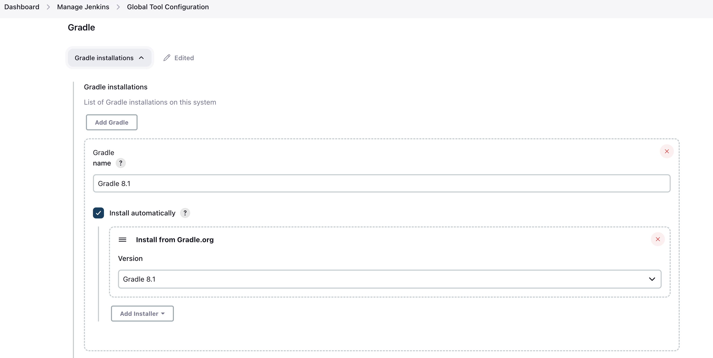
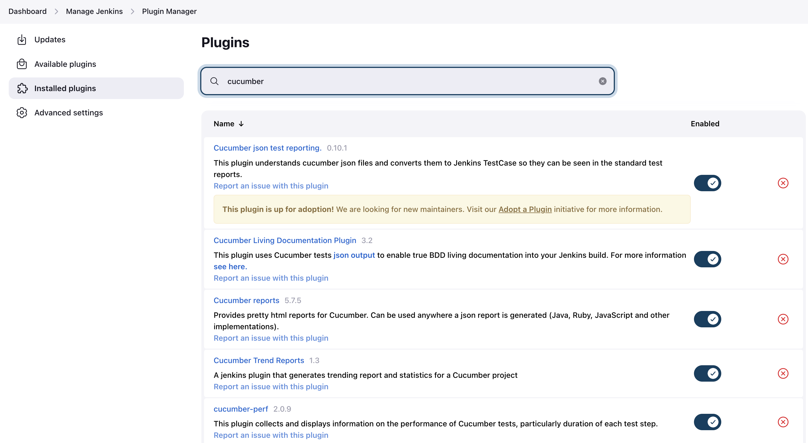
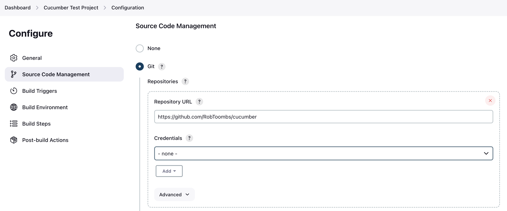
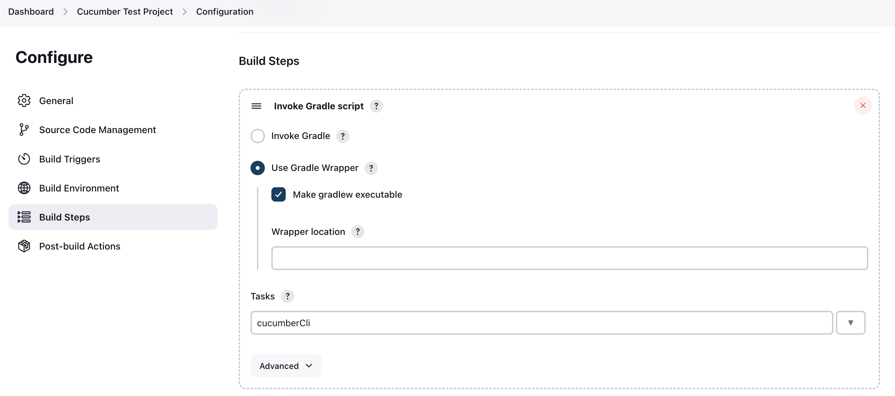
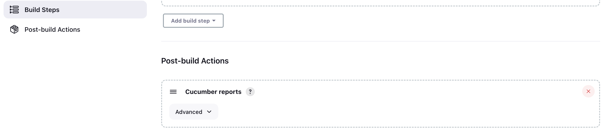
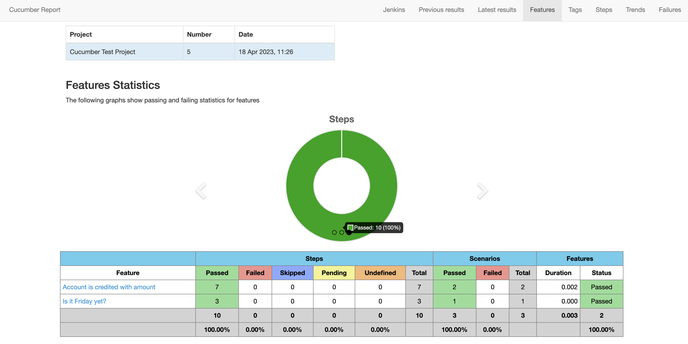

Project for getting into Cucumber/Gherkin tests and Jenkins!
---
Execute tests using `./gradlew test` this will also update the [Cucumber Report](./target/cucumber-report.html) 

Alternatively `./gradlew cucumber` will run execute cucumber runner, but this does not update the report.

---

Setting Up Jenkins!

Assuming you have gone through the process of setting up Jenkins locally (https://www.jenkins.io/doc/book/installing/macos/):

1. Setup the Gradle 'Global Tool Configuration' 
2. Add Cucumber plugins 
3. Create a new "Freestyle Project"
4. Configure 'Source Code Management' to point to your Git repo 
5. Configure the Gradle build steps to use the repo wrapper + execute the Cucumber CLI tests  
6. Configure Post-build action to report the Cucumber test results 
7. Check out the 'Cucumber reports' after a fresh build 